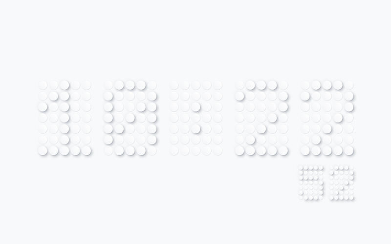

# Dot Clock

## What is this?

A nice-looking clock.

That's it.

## What does it look like?



## Where to get it?

Can be seen online [here](https://dot-clock.vercel.app)

Can be installed as a chrome new tab [here](https://chromewebstore.google.com/detail/dot-clock-new-tab/jfogelnhopilplmccfbjcecpeddognlp)

## Character definitions

for reference

### <kbd>:<kbd>

```
[, , , , ,],
[, , , , ,],
[, , 1, , ,],
[, , , , ,],
[, , 1, , ,],
[, , , , ,],
[, , , , ,]
```

### <kbd>0<kbd>

```
[, 1, 1, 1, ,],
[1, , , , 1],
[1, , , 1, 1],
[1, , 1, , 1],
[1, 1, , , 1],
[1, , , , 1],
[, 1, 1, 1, ,]
```

### <kbd>1<kbd>

```
[, , 1, , ,],
[, 1, 1, , ,],
[1, , 1, , ,],
[, , 1, , ,],
[, , 1, , ,],
[, , 1, , ,],
[1, 1, 1, 1, 1]
```

### <kbd>2<kbd>

```
[, 1, 1, 1, ,],
[1, , , , 1],
[, , , , 1],
[, , , 1, ,],
[, , 1, , ,],
[, 1, , , ,],
[1, 1, 1, 1, 1]
```

### <kbd>3<kbd>

```
[, 1, 1, 1, ,],
[1, , , , 1],
[, , , , 1],
[, , 1, 1, ,],
[, , , , 1],
[1, , , , 1],
[, 1, 1, 1, ,]
```

### <kbd>4<kbd>

```
[, , , 1, ,],
[, , 1, 1, ,],
[, 1, , 1, ,],
[1, , , 1, ,],
[1, 1, 1, 1, 1],
[, , , 1, ,],
[, , , 1, ,]
```

### <kbd>5<kbd>

```
[1, 1, 1, 1, 1],
[1, , , , ,],
[1, 1, 1, 1, ,],
[, , , , 1],
[, , , , 1],
[1, , , , 1],
[, 1, 1, 1, ,]
```

### <kbd>6<kbd>

```
[, 1, 1, 1, ,],
[1, , , , 1],
[1, , , , ,],
[1, 1, 1, 1, ,],
[1, , , , 1],
[1, , , , 1],
[, 1, 1, 1, ,]
```

### <kbd>7<kbd>

```
[1, 1, 1, 1, 1],
[, , , , 1],
[, , , 1, ,],
[, , 1, , ,],
[, 1, , , ,],
[, 1, , , ,],
[, 1, , , ,]
```

### <kbd>8<kbd>

```
[, 1, 1, 1, ,],
[1, , , , 1],
[1, , , , 1],
[, 1, 1, 1, ,],
[1, , , , 1],
[1, , , , 1],
[, 1, 1, 1, ,]
```

### <kbd>9<kbd>

```
[, 1, 1, 1, ,],
[1, , , , 1],
[1, , , , 1],
[, 1, 1, 1, 1],
[, , , , 1],
[1, , , , 1],
[, 1, 1, 1, ,]
```
